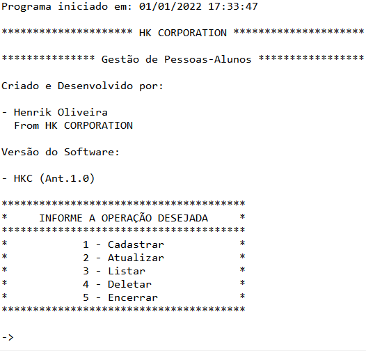
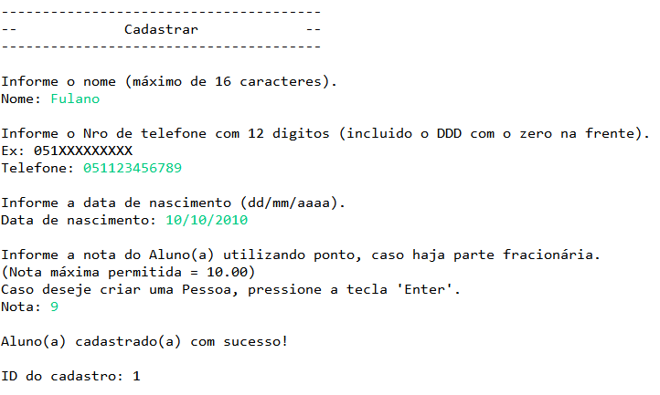
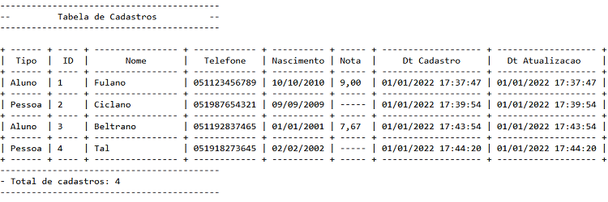

# ProjetoCRUD-java
 

# Sobre o projeto

ProjetoCRUD-java é uma aplicação de console construída para o processo seletivo da +prati em parceria com a AlfaMidia.

A aplicação consite em um sistema de cadastro de Pessoa/Aluno, onde pode ser realizado algumas manipulações com os dados cadastrados.

## Algumas Screenshots do Sistema

  
  
  

# Autor

Henrik Oliveira

https://www.linkedin.com/in/henrik-oliveira
